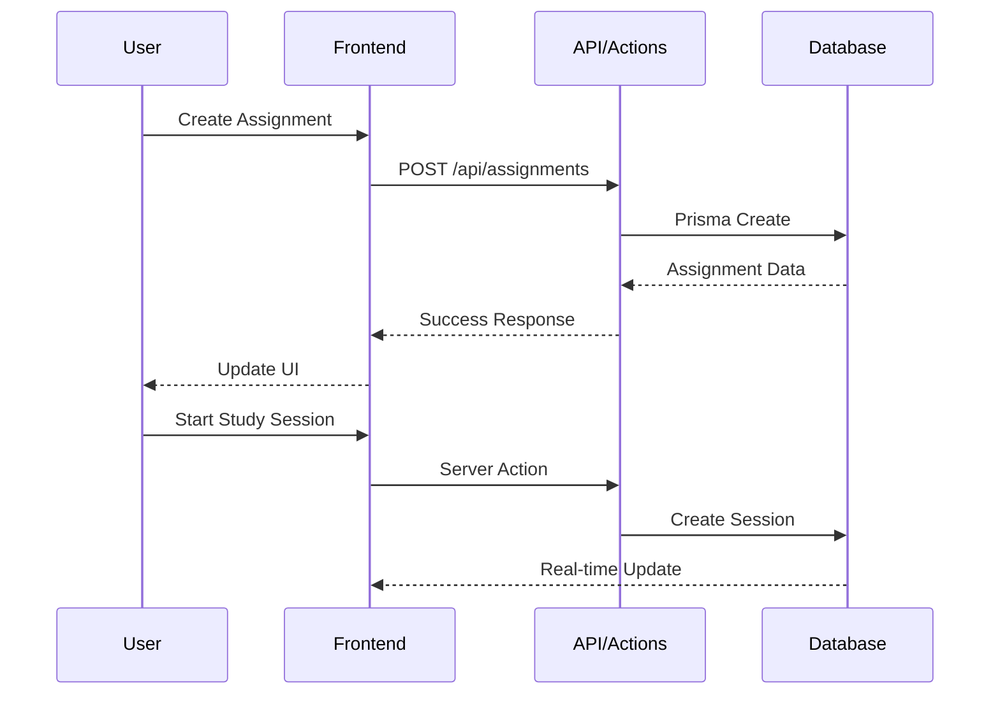

<div align="center">

# 🎓 StudyOps Agent

<p align="center">
  
  
  
  
  
</p>

<h3>Your AI-Powered Study Companion for Academic Excellence</h3>

<p align="center">
  A comprehensive study and assignment management platform designed to help students track assignments, manage study sessions, analyze errors, and master concepts through intelligent tracking and AI assistance.
</p>

<p align="center">
  <a href="#-features">Features</a> •
  <a href="#-quick-start">Quick Start</a> •
  <a href="#-tech-stack">Tech Stack</a> •
  <a href="#-architecture">Architecture</a> •
  <a href="#-contributing">Contributing</a>
</p>

---

</div>

## ✨ Features

<table>
<tr>
<td width="50%">

### 📚 Core Features

🎯 **Assignment Management**
- Create, track, and manage assignments with deadlines
- Requirement checklists and rubric tracking
- Progress visualization and status updates
- Automatic overdue detection

⏱️ **Study Session Tracking**
- Pomodoro timer with focus scoring
- Activity type categorization
- Real-time session monitoring
- Comprehensive session history

📄 **Material Management**
- Upload PDFs, images, and documents
- Automatic text extraction from PDFs
- Organize materials by assignment
- Full-text search capabilities

</td>
<td width="50%">

### 🚀 Advanced Features

🐛 **Error Logging & Analysis**
- Track coding errors and mistakes
- Pattern detection for recurring issues
- Fix duration tracking
- Help level categorization

🧠 **Concept Mastery System**
- Spaced repetition algorithm
- Mastery level calculation
- Review scheduling
- Concept relationships tracking

📊 **Analytics Dashboard**
- Study time visualizations
- Productivity metrics
- Assignment completion rates
- Error trend analysis

</td>
</tr>
</table>

### 💎 Technical Excellence

<div align="center">

| Feature | Description |
|---------|-------------|
| 📱 **Responsive Design** | Works flawlessly on desktop, tablet, and mobile |
| 🎨 **Modern UI** | Beautiful interface with shadcn/ui components |
| 🌙 **Dark Mode** | Easy on the eyes during late-night study sessions |
| ⚡ **Fast & Efficient** | Optimized performance with Next.js 15 |
| 🔒 **Type-Safe** | Full TypeScript coverage for reliability |
| 🎯 **Accessible** | WCAG compliant for all users |

</div>

## 🛠️ Tech Stack

<div align="center">

### Frontend Layer
<p>
  
  
  
  
  
</p>

### Backend Layer
<p>
  
  
  
  
</p>

### Supporting Libraries
<p>
  
  
  
  
  
</p>

</div>

<table>
<tr>
<td width="33%">

#### 🎨 Frontend
- **Next.js 15** - App Router
- **React 19** - Server/Client Components
- **TypeScript** - Type safety
- **Tailwind CSS 4** - Styling
- **shadcn/ui** - Components
- **Recharts** - Visualizations

</td>
<td width="33%">

#### ⚙️ Backend
- **Next.js API Routes** - Serverless
- **Prisma ORM** - Database layer
- **SQLite/PostgreSQL** - Database
- **Server Actions** - Mutations
- **Zod** - Validation

</td>
<td width="33%">

#### 📦 Tools & Libraries
- **react-hook-form** - Forms
- **Zustand** - State management
- **date-fns** - Date utilities
- **lucide-react** - Icons
- **pdf-parse** - PDF extraction
- **OpenAI API** - AI features

</td>
</tr>
</table>

## 🚀 Quick Start

### Prerequisites

<div align="center">

| Requirement | Version | Description |
|------------|---------|-------------|
| 📦 Node.js | 18.x+ | JavaScript runtime |
| 📥 npm/yarn | Latest | Package manager |
| 🔧 Git | 2.x+ | Version control |

</div>

### Installation

```bash
# 1️⃣ Clone the repository
git clone https://github.com/Sant0-9/studyOpsAgent.git
cd studyops-agent

# 2️⃣ Install dependencies
npm install

# 3️⃣ Set up environment variables
cp .env.example .env.local

# 4️⃣ Initialize database
npx prisma generate
npx prisma db push
npx prisma db seed

# 5️⃣ Start development server
npm run dev
```

<div align="center">

🎉 **Open [http://localhost:3000](http://localhost:3000) to see your app!**

</div>

### Environment Configuration

Create a `.env.local` file in the root directory:

```env
# Database
DATABASE_URL="file:./dev.db"

# App Configuration
NEXT_PUBLIC_APP_NAME="StudyOps Agent"
NEXT_PUBLIC_APP_VERSION="0.1.0"

# Optional: AI Features
OPENAI_API_KEY="your_openai_api_key_here"
```

### Development Commands

```bash
# Start development server
npm run dev

# Build for production
npm run build

# Start production server
npm start

# Run linting
npm run lint

# Open Prisma Studio (Database GUI)
npx prisma studio
```

## 🗄️ Database Management

<div align="center">

### Prisma CLI Commands

| Command | Description |
|---------|-------------|
| `npx prisma generate` | Generate Prisma Client |
| `npx prisma db push` | Push schema changes to database |
| `npx prisma migrate dev` | Create and apply migrations |
| `npx prisma db seed` | Seed database with sample data |
| `npx prisma studio` | Open Prisma Studio GUI |
| `npx prisma format` | Format schema file |

</div>

## 🏗️ Architecture



```mermaid
graph TB
    A[Next.js Frontend] --> B[API Routes]
    A --> C[Server Actions]
    B --> D[Prisma ORM]
    C --> D
    D --> E[(SQLite/PostgreSQL)]

    F[Study Materials] --> A
    G[Assignments] --> A
    H[Sessions] --> A
    I[Analytics] --> A

    style A fill:#0070f3
    style D fill:#2D3748
    style E fill:#336791
```

### Data Flow



## 📁 Project Structure

```
studyops-agent/
├── 📂 src/
│   ├── 📂 app/                    # Next.js App Router
│   │   ├── 📂 api/                # API route handlers
│   │   │   ├── assignments/      # Assignment endpoints
│   │   │   ├── materials/        # Material endpoints
│   │   │   ├── sessions/         # Session endpoints
│   │   │   ├── errors/           # Error tracking endpoints
│   │   │   ├── concepts/         # Concept endpoints
│   │   │   └── settings/         # Settings endpoints
│   │   ├── 📂 assignments/        # Assignment pages
│   │   ├── 📂 study/              # Study session pages
│   │   ├── 📂 materials/          # Material management
│   │   ├── 📂 analytics/          # Analytics dashboard
│   │   ├── 📂 settings/           # Settings pages
│   │   └── layout.tsx            # Root layout
│   ├── 📂 components/
│   │   ├── 📂 ui/                 # shadcn/ui components
│   │   ├── 📂 features/           # Feature components
│   │   └── 📂 layout/             # Layout components
│   ├── 📂 lib/
│   │   ├── 📂 db/                 # Database utilities
│   │   │   ├── prisma.ts         # Prisma client
│   │   │   └── queries.ts        # Database queries
│   │   ├── 📂 actions/            # Server Actions
│   │   ├── 📂 hooks/              # Custom React hooks
│   │   ├── 📂 validations/        # Zod schemas
│   │   └── 📂 utils/              # Helper functions
│   ├── 📂 types/                  # TypeScript definitions
│   └── 📂 styles/                 # Global styles
├── 📂 prisma/
│   ├── schema.prisma             # Database schema
│   └── seed.ts                   # Seeding script
├── 📂 public/                     # Static assets
└── package.json
```

## 🤝 Contributing

<div align="center">

We love contributions! Here's how you can help make StudyOps Agent even better:

</div>

### How to Contribute

1. **🍴 Fork the repository**
2. **🌿 Create your feature branch**
   ```bash
   git checkout -b feature/AmazingFeature
   ```
3. **💾 Commit your changes**
   ```bash
   git commit -m 'Add some AmazingFeature'
   ```
4. **📤 Push to the branch**
   ```bash
   git push origin feature/AmazingFeature
   ```
5. **🎉 Open a Pull Request**

### Contribution Guidelines

- Follow the existing code style
- Write meaningful commit messages
- Add tests for new features
- Update documentation as needed
- Be respectful and constructive

## 📜 License

<div align="center">

This project is licensed under the **MIT License** - see the [LICENSE](LICENSE) file for details.

</div>

## 💬 Support

<div align="center">

Having issues? We're here to help!

[](https://github.com/Sant0-9/studyOpsAgent/issues)
[](https://github.com/Sant0-9/studyOpsAgent/discussions)

</div>

## 🙏 Acknowledgments

<div align="center">

Built with incredible tools and libraries:

[Next.js](https://nextjs.org/) • [React](https://react.dev/) • [Prisma](https://www.prisma.io/) • [Tailwind CSS](https://tailwindcss.com/) • [shadcn/ui](https://ui.shadcn.com/) • [Lucide](https://lucide.dev/)

---

<h3>⭐ If you find this project helpful, please consider giving it a star!</h3>

**Built with care for students, by students** 🎓

</div>
